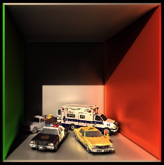

VCTGI
=====

Real-time global illumination renderer using voxel cone tracing (without SVO).

### Hints and Compilation

The main parts of the renderer are located in `src/executables/VCTGI` and `src/shaders/VCTGI`.  Some classes in `src/libraries/CVK_Framework` are modified, in particular `CVK_ShaderSet`.  Empty space skipping, conservative rasterization and soft shadows can be enabled in the shaders `Voxelization.geom`, `DirectIllumination.frag` and `Globalllumination.frag` respectively.  The code is tested on Linux and should compile with `cmake` on Windows too.

### System Requirements

* OpenGL 4.4
* NVIDIA graphics card
* 1GB video RAM

### References and Resources

* https://research.nvidia.com/publication/interactive-indirect-illumination-using-voxel-cone-tracing
* https://research.nvidia.com/publication/octree-based-sparse-voxelization-using-gpu-hardware-rasterizer
* http://maverick.inria.fr/Membres/Cyril.Crassin/thesis/
* http://rauwendaal.net/phd-thesis/
* http://http.developer.nvidia.com/GPUGems2/gpugems2_chapter42.html
* http://on-demand-gtc.gputechconf.com/gtcnew/on-demand-gtc.php?searchByKeyword=panteleev&submit=
* http://on-demand.gputechconf.com/gtc/2014/presentations/S4552-rt-voxel-based-global-illumination-gpus.pdf
* https://github.com/domme/VoxelConeTracing
* http://www.naixela.com/alex/
* http://simonstechblog.blogspot.de/2013/01/implementing-voxel-cone-tracing.html
* http://tf3dm.com/3d-model/cars-66597.html
